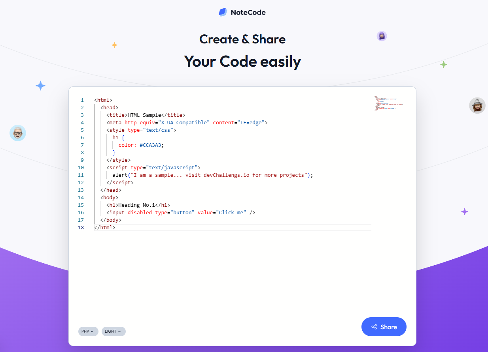
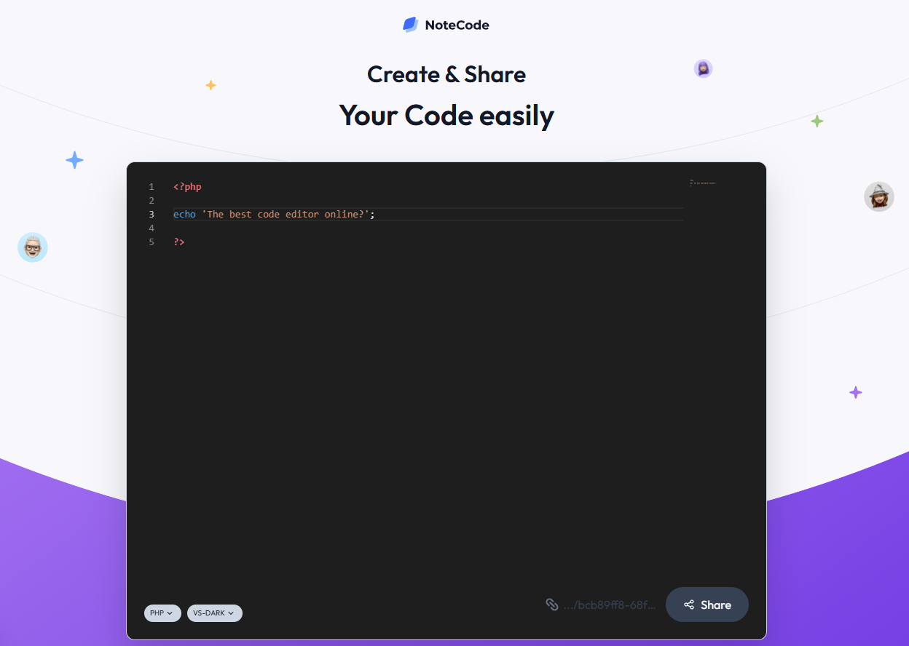

# NoteCode 📝

A modern, responsive code sharing app built with Next.js and Supabase.

https://notecode-nu.vercel.app/

## About the Project

This is a fully responsive code editor that allows you to edit 5 different programming languages. But that’s not all! It also lets you customize the style (light and dark modes) and share your code!

It’s simple! Write your code, click a button, and copy the link to share it with a friend.

## Available Programming Languages

- HTML
- Javascript
- CSS
- Java
- PHP

## Screenshots




## Getting Started

To get a local copy up and running follow these steps.

### Prerequisites

1. Node.js and npm/yarn installed.

2. Clone the repository.

   ```bash
   git clone

   ```

3. Navigate to the project
   ```bash
   cd notecode
   ```

### Installation

1. Install all dependencies.

   ```bash
   npm install --legacy-peer-deps
   ```

2. Set env.

   - Create .env.local file in root folder.
   - Add variable SUPABASE_KEY

3. Run the project.
   ```bash
   npm run dev
   ```

## Built With

- [Next.js](https://nextjs.org/)
- [TailwindCSS](https://tailwindcss.com/)
- [Supabase](https://supabase.io/)
- [MonacoEditor/react](https://www.npmjs.com/package/@monaco-editor/react)
